# projecthub.nvim

<p align="center">
  <strong>A fast, aesthetic, and visual project dashboard & switcher for Neovim.</strong>
</p>

<p align="center">
  <a href="https://neovim.io"></a>
  <a href="https://www.lua.org"></a>
  <a href="LICENSE"></a>
  
</p>

---

**`projecthub.nvim`** scans your repository folders and displays them as rich, interactive project cards with real-time Git status, language breakdown bars, disk lines-of-code statistics, GitHub metadata, and instant project jumping with **Neo-tree** and `README.md` in one keystroke.

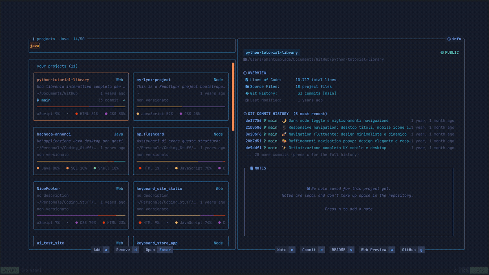

---

## Features

- **Guided First Run**: With no projects configured yet, the dashboard opens a welcome screen offering either an automatic folder scan (`s`) or manual picking (`a`) — no config editing needed to get started.
- **Zero-Latency Startup**: Background asynchronous scanning without UI blocking.
- **Project Cards**: Language breakdown progress bars, branch, dirty/staged/untracked indicators, sync status (ahead/behind), and last modified time.
- **Smart Live Filtering**:
  - Fuzzy text search by project name, path, or description.
  - Exact language matching: `lua`, `python`, `typescript`, `rust`, `go`, `kotlin`, `java`, `swift`, `c`, `cpp`, etc.
  - Visibility tags: `PUBBLICO` (`PUBLIC`), `PRIVATO` (`PRIVATE`), `LOCALE` (`LOCAL`, `untracked`).
- **Deep Inspector Panel**:
  - Asynchronous Lines-of-Code (LOC) calculator and file counter.
  - Commit tag badges: `feat:`, `[FIX]`, `fix(core)!:`, `DOCS - …` and other common spellings are all recognised at the start of a subject and rendered as one uniform coloured badge, so you can find every fix in a long history by colour alone. 19 tags, coloured by what kind of risk the commit carries.
  - Infinite-scroll Git commit timeline (`c`) with automatic pagination (+100 commits).
  - Contributor breakdown with role icons (Owner, Organization, Member).
- **Persistent GitHub Cache**: Authenticated `gh api` queries retrieve stars, forks, visibility, and parent forks with instant `0ms` startup cache saved to disk.
- **Folder Browser (`a`)**: Add new projects on the fly with duplicate detection.
- **Missing Project Self-Healing (`r` / `d`)**: Highlights moved/renamed folders and offers a 1-click reconnect flow.
- **External Drive Awareness (SSD / USB)**: Projects living on removable volumes are detected and labelled with their volume name. When the drive is unplugged the card stays in the list in a *disconnected* state, showing the cached name, description, type and language breakdown instead of vanishing. Plug the drive back in and the dashboard picks it up on its own, with no manual refresh.
- **Scratchpad Notes (`n`)**: Dedicated per-project persistent notes editor.
- **README & Web Previews**: Embedded Markdown preview (`s`) or browser preview (`w`).
- **UI Sound Effects**: Subtle audio feedback on typing, selection and notifications, bundled with the plugin (no downloads, no external player to install beyond what your OS already provides). Toggle at runtime with `:ProjectHubSound`, or set `sound.enabled = false`. Volume is configurable and the choice is remembered across restarts.
- **Live Star Watcher**: Opt in and ProjectHub keeps an eye on your GitHub repositories in the background. The moment one picks up a star, you get a ProjectHub notification — same shape as every other one the plugin shows — in achievement gold, naming the repo, the new total and *who* starred it, with an `achievement` chime. Choose whether to watch only what you own, or also repos you actively contribute to. See [Star Watcher](#star-watcher).
- **Bilingual (EN / IT)**: Switch language at runtime (`L` / `:ProjectHubLang`) or via config.
- **Full Mouse & Keyboard Support**: Smooth scrolling with wheel, scrollbar dragging, and responsive single/two-column layouts.

---

## Screenshots

**First run** — with nothing configured yet, the dashboard explains itself and offers both routes:

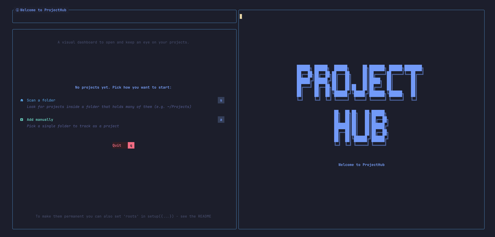

| Project Cards Overview | Language & Tag Search |
|:---:|:---:|
| 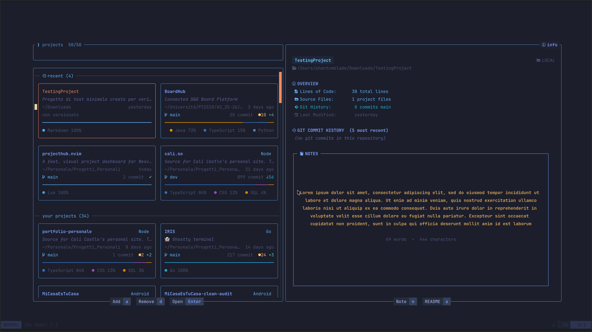 | 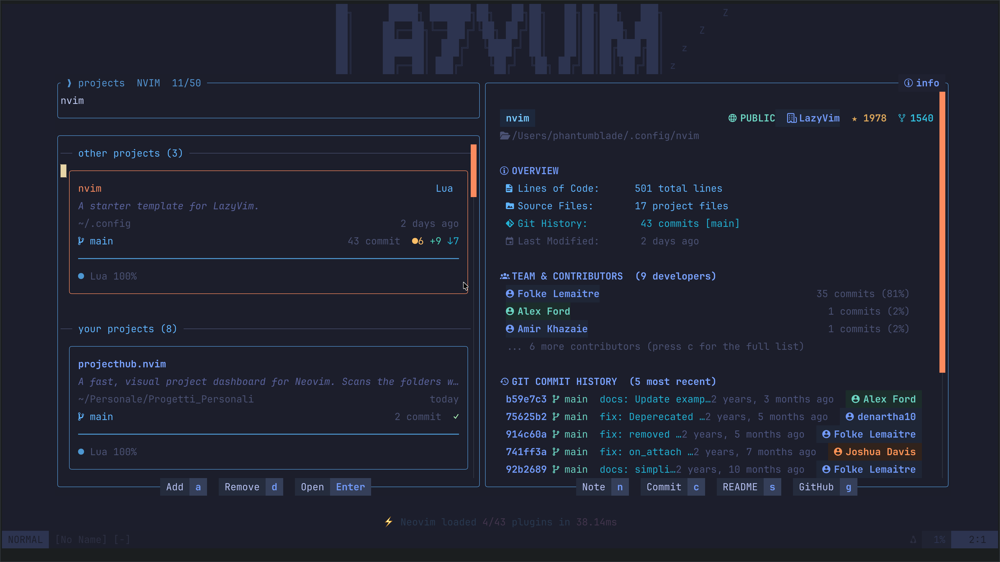 |

| Infinite-Scroll Commit History (`c`) | Markdown README Preview (`s`) |
|:---:|:---:|
| 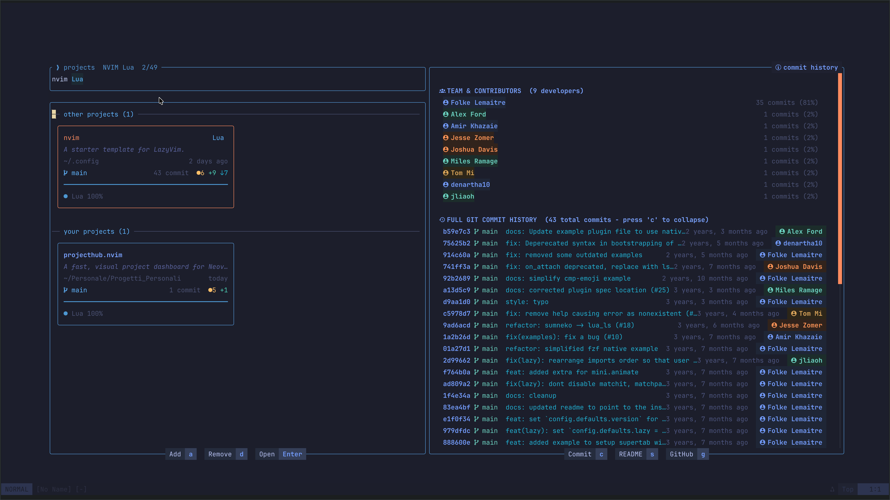 | 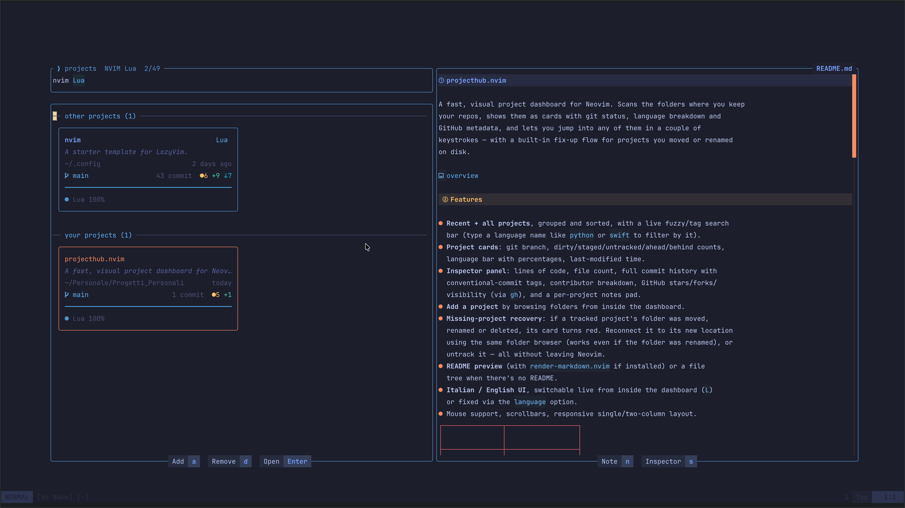 |

| Interactive Folder Browser (`a`) | Scratchpad Notes (`n`) |
|:---:|:---:|
| 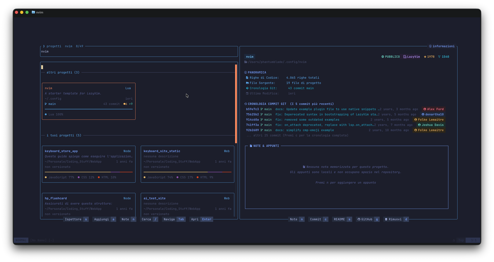 | 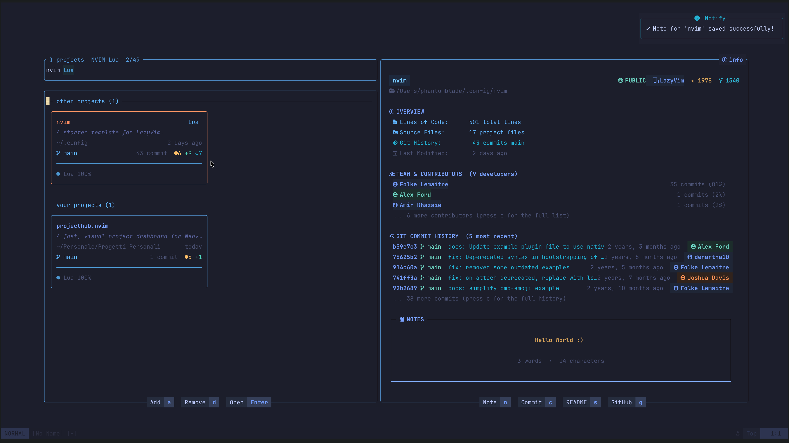 |

| Smart Empty State with Tags | Deep Inspector & Git Stats |
|:---:|:---:|
| 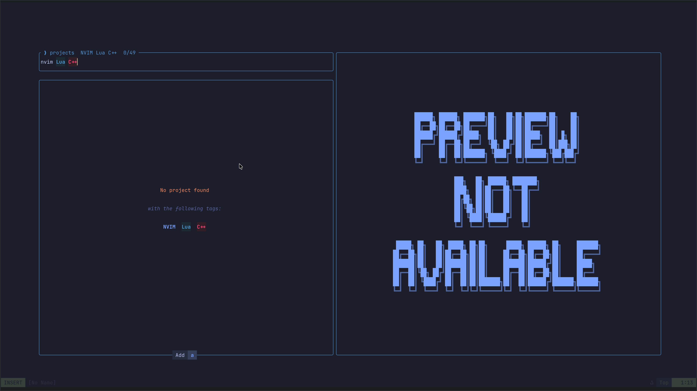 | 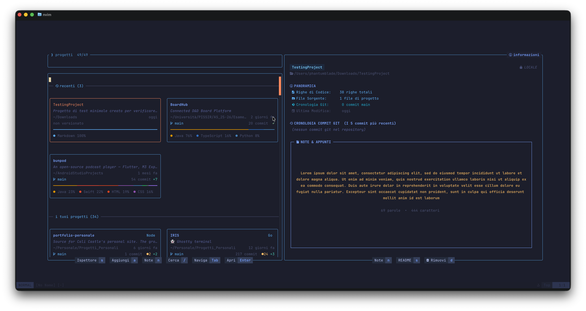 |

| Commits Waiting on Upstream | External Drive Unplugged |
|:---:|:---:|
| 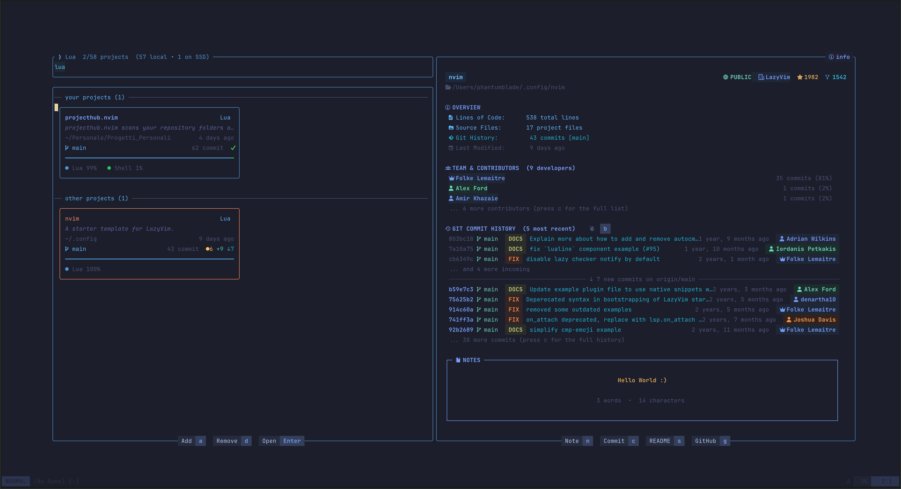 | 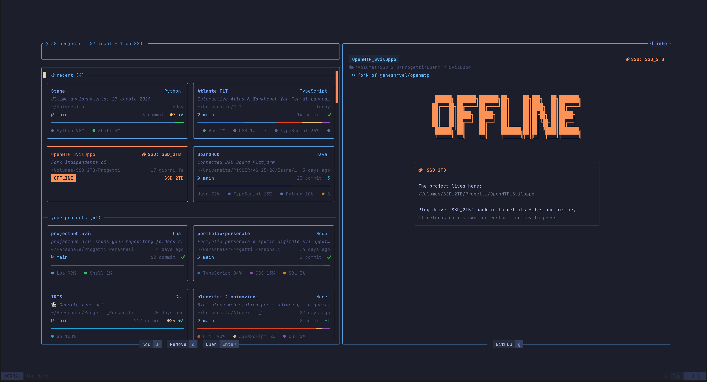 |

---

## Requirements

- **Neovim >= 0.10**
- **[git](https://git-scm.com/)** available on `$PATH`
- A **[Nerd Font](https://www.nerdfonts.com/)** for terminal icons

### Optional Integrations
- **[`gh` (GitHub CLI)](https://cli.github.com/)**: GitHub stars, forks, and visibility metadata. Also required by the [star watcher](#star-watcher), which needs it authenticated (`gh auth login`).
- **An audio player, for the sound effects**: macOS already ships `afplay`, so nothing to install. On Linux any one of `pw-play`, `paplay`, `mpv` or `ffplay` is used, whichever is found first. On Windows `ffplay`, falling back to PowerShell. Without any of them the plugin simply stays silent.
- **[`nvim-neo-tree/neo-tree.nvim`](https://github.com/nvim-neo-tree/neo-tree.nvim)**: Opened automatically on the left when opening a project.
- **[`MeanderingProgrammer/render-markdown.nvim`](https://github.com/MeanderingProgrammer/render-markdown.nvim)**: Formatted Markdown preview.
- **[`folke/snacks.nvim`](https://github.com/folke/snacks.nvim)**: Dashboard button integration.
- **[`echasnovski/mini.icons`](https://github.com/echasnovski/mini.icons)**: Enhanced file/folder icons.

---

## Installation & Setup

### 1. Where to put the configuration

Create a new plugin file in your Neovim config (e.g. `~/.config/nvim/lua/plugins/projecthub.lua`):

#### With [lazy.nvim](https://github.com/folke/lazy.nvim) (Recommended)

```lua
return {
  "phantumblade/projecthub.nvim",
  -- Every command that should work before the dashboard has been opened once
  -- must be listed here, otherwise lazy.nvim has nothing to load the plugin on.
  cmd = {
    "ProjectHub", "PH",
    "ProjectHubLang", "PHLang", "PHl",
    "ProjectHubSound", "PHSound",
    "ProjectHubStars", "PHStars", "PHStarsDemo", "PHStarsCheck", "PHStarsRehearse",
    "ProjectHubNotify", "PHNotify",
  },
  keys = {
    { "<leader>p", "<cmd>ProjectHub<cr>", desc = "ProjectHub Dashboard" },
  },
  opts = {
    language = "en", -- "en" or "it" (switchable anytime with 'L' or :ProjectHubLang)
    -- Folders to scan: { path, search_depth }
    roots = {
      { "~/Projects", 1 },
      { "~/Work", 2 },
    },
    -- Individual project folders outside roots
    extra = {
      "~/.config/nvim",
    },
    -- Your GitHub/GitLab usernames (for owner badge & author filtering)
    me = {
      owners = { "your-github-username" },
    },
    -- UI Sound Effects (uisfx minimal preset)
    sound = {
      enabled = true, -- set false to disable all sounds
      volume = 0.5,   -- volume level (0.0 to 1.0)
    },
  },
}
```

#### With [pckr.nvim](https://github.com/lewis6991/pckr.nvim) / [packer.nvim](https://github.com/wbthomason/packer.nvim)

```lua
use({
  "phantumblade/projecthub.nvim",
  config = function()
    require("projecthub").setup({
      roots = { { "~/Projects", 1 } },
      extra = { "~/.config/nvim" },
    })
  end,
})
```

---

## How to Run ProjectHub

You can start ProjectHub using any of the following methods:

1. **User Commands**:
   - `:ProjectHub` (or `:PH`) — Open dashboard.
   - `:ProjectHubLang` (or `:PHLang`, `:PHl`) — Switch language between Italian and English.
2. **Keybinding**:
   - Press `<leader>p` (or your configured keymap).
3. **Lua API**:
   ```lua
   require("projecthub").open()
   ```
4. **Snacks Dashboard Integration** *(Optional)*:
   ```lua
   { icon = "P ", key = "p", desc = "Projects", action = ":ProjectHub" }
   ```

---

## Configuration Reference

All settings with their default values:

```lua
require("projecthub").setup({
  -- Interface language: "en" (English) or "it" (Italian)
  language = "en",

  -- Directories to automatically scan: { path, search_depth }
  roots = {},

  -- Standalone project directories
  extra = {},

  -- GitHub usernames considered "yours" (to highlight owner badges)
  me = {
    owners = {},
  },

  -- Custom icons (Nerd Font unicode characters)
  icons = {
    owner = "\u{edeb} ",  -- Crown icon (repo owner)
    org = "\u{f42b} ",    -- Organization icon
    member = "\u{f0009} ", -- Member/contributor icon
    fork = "\u{ea63} ",   -- Fork icon
  },

  -- Window layout and responsive split
  window = {
    width = 0.90,       -- Window width ratio (0.1 - 1.0)
    height = 0.85,      -- Window height ratio (0.1 - 1.0)
    left_ratio = 0.48,  -- Ratio between left list and right inspector panel
    min_card = 34,      -- Minimum card width before switching to single column
  },

  -- Sound effects (bundled out-of-the-box, zero external downloads needed)
  sound = {
    enabled = true,     -- Set to false to disable all audio feedback
    volume = 0.5,       -- Volume level (0.0 to 1.0)
  },

  -- GitHub star watcher. Off by default: the plugin will not reach out to
  -- the network on its own unless you enable this. Requires `gh` authenticated.
  stars = {
    enabled = false,        -- Start watching when Neovim opens
    scope = "owner",        -- "owner" | "contributor" | "all"
    interval = 120,         -- Seconds between checks (minimum 30)
    owners = {},            -- Accounts to watch; empty = whoever `gh` is logged in as
    color = "#E3B341",      -- Accent colour: border, title and star
    title = nil,            -- Custom title text; nil uses the translated one
    sound = "achievement",  -- Sound name, or false to notify silently
  },

  -- Incoming commits. The history always shows your local repository; when
  -- upstream has newer commits a background `git fetch` picks them up and the
  -- inspector lists them above a divider, separated from the point you are
  -- synced at. The fetch only updates remote refs: HEAD, the index and the
  -- working tree are never touched.
  incoming = {
    enabled = true,   -- false to never reach out to the network
    interval = 300,   -- Seconds between two fetches of the same repo (minimum 60)
    timeout = 15,     -- Seconds after which a stuck fetch is abandoned
    notify = true,    -- Announce when new commits show up
    notify_max_authors = 5, -- Above this many contributors: followed silently,
                            -- and from further away. `b` overrides per project.
  },

  -- How often to re-read git for projects you are not looking at. A project
  -- untouched for months does not change while the dashboard is open, and
  -- re-reading it every thirty seconds alongside the rest was most of the work
  -- the plugin did for nothing. Age is measured on the more recent of the last
  -- commit and the last file change.
  --
  -- Whatever the band, these stay immediate: the selected project (every 5s -
  -- it is the one you are reading), returning to the window, and saving a file.
  polling = {
    active_days = 7,     -- up to here: full sweep every 30 seconds
    warm_days = 30,      -- up to here: full sweep every 5 minutes
                         -- beyond: only on open, on focus, or when selected
    warm_interval = 300, -- seconds between sweeps of the middle band
  },

  -- Custom open callback. If nil, defaults to:
  -- changing cwd (`cd`), opening README.md in main buffer, and opening Neo-tree.
  on_open = nil,
})
```


---

## Incoming commits

The dashboard reads your local clone. Until something runs `git fetch`, commits your collaborators pushed to the remote simply do not exist as far as the repository on disk is concerned — the panel would faithfully show a version of the project that is days behind, with no hint that anything is missing.

ProjectHub closes that gap with a throttled background fetch. Every repository with an upstream is refreshed at most once per `interval` (300s by default), through `jobstart`, so nothing ever blocks the editor. The fetch updates remote refs and nothing else: `HEAD`, the index and the working tree are left exactly as they were, and no merge is ever attempted on your behalf. Deciding when to pull stays yours.

What comes back is `git log HEAD..@{u}` — the commits that exist upstream and not yet locally. They are rendered **above** a divider that marks the point you are synced at:

```
 󰋚 CRONOLOGIA COMMIT GIT  (I 5 commit più recenti)
  6a5c132 󰘬 origin/main   CHORE  Formattazione e pulizia…    25 ore fa   lama-development
  31cbb9c 󰘬 origin/main   FEAT   Aggiunta API statistiche…  25 ore fa   lama-development
  a31e520 󰘬 origin/main   FEAT   Selezione di posizioname…  4 giorni fa lama-development
  ─────────────────── ↓ 3 nuovi commit su origin/main ───────────────────
  6ac5473 󰘬 main   DOCS   Aggiunta guida completa…          5 giorni fa Andrea Perini
  587fc76 󰘬 main   FIX    Corretta sequenza warm-up…        5 giorni fa Andrea Perini
```

Everything above the line is on the remote; everything below is the version you actually have. Incoming rows carry the upstream branch name instead of the local one and an amber hash, so the two never blur together. Contributor roles — the owner crown included — are resolved the same way as for local commits.

The overview keeps the three freshest and counts the rest; `c` opens the full history and lists them all.

### Staying quiet and staying cheap

Discoveries come back one repository at a time, in whatever order the fetches finish. Announcing each one turned opening the dashboard into a wall of notifications, so they are collected and **a single notice** goes out once the burst settles — naming the project when there is one, or listing them when there are several. One redraw per burst, too.

Not every repository deserves an announcement. A project with a handful of contributors is yours or a small group's, and a commit from someone else is news. A project with a dozen is almost always somebody else's repository you cloned, where new commits are just weather. So above `notify_max_authors` (5 by default) a project is followed **silently and from four times further away** — the divider still appears in the panel, only the notification is withheld. The author count comes from the shortlog `load_git` already runs, so the decision costs nothing.

Press **`b`** on any project to override that in either direction: mute the small project you do not care about, or watch the crowded one you do. The choice is remembered across sessions, and a project whose contributor count later grows past the threshold falls back to the automatic behaviour rather than staying pinned. A bell beside the commit history header shows the current state - gold when notices are on, grey when muted - with the key to flip it.

Three more rules keep the cost invisible:

- **A sliding window**, never a stampede: at most 3 fetches run at once, the rest queue behind them.
- **Backoff**: every fetch that finds nothing doubles the wait for that repository, up to 8× the interval. Repositories that actually move keep the base rhythm; dormant ones drift towards half-hourly.
- **Typing wins**: no git process is ever spawned while you are typing in the search, and the first sweep waits until the window has drawn and settled.
- **A remembered baseline**: what you have already seen is kept on disk (`incoming_seen.json`), so reopening Neovim does not re-announce the same backlog. Only what appeared since the last look is news.

---

## Disconnected drives are a state, not an error

A project living on an external drive is not missing when the drive is unplugged - it is simply out of reach, and it comes back the moment the drive does. Those two situations look nothing alike and should not read alike: a project whose folder was deleted or moved gets the red card and offers to reconnect or forget it, while one on an unplugged drive gets the amber panel, the drive glyph, and the only instruction that applies - plug the drive back in.

The offline panel is built for one job, so it says one thing loudly: the state is spelled out in block letters across the middle of the pane, in amber, the way the opening screen spells the plugin's name. It is the headline of that screen, not a note in the corner, so there is no badge repeating it in the top right and no section heading announcing a panel that contains a single message. Below it, centred, a dimmed frame holds the two things left to know - where the project lives, and that plugging the drive back in is the whole remedy. The drive glyph appears once, beside the volume name, instead of on the title, the folder line and the status row as well.

Panes too narrow for the block letters keep the word exactly where it is, written in ordinary characters and the same amber. Only the size changes.

The footer is modular: on an unplugged drive there are no files, so Note, Tree and Commit would be keys that do nothing, and a key that does nothing is worse than an absent one. GitHub stays - its URL lives in the metadata cache, so it works with the drive out.

Plugging the drive back in is noticed within half a second. The check is one `stat` per external project, so it runs on every tick rather than riding along with the git polling that spawns processes; it used to take up to five seconds to notice a drive that was already mounted.

Which of the two you see hinges on the path being in canonical form. Repeated slashes point at exactly the same folder as far as the filesystem is concerned, but they are a different string, and a different string is a different key: one stray slash was enough for a project to appear twice, the second time as deleted, because `//Volumes/...` no longer matched the `/Volumes/` prefix the external-drive check looks for. Every path that serves as an identity - cache keys, recents, notes, custom entries - now goes through `normalize_path` first, and cache keys written by older versions are folded into canonical form as they are read, so duplicates collapse on their own. `tests/paths_spec.lua` covers it.

---

## Machines in the history

A commit written by a pipeline or an assistant does not read like one written by hand, and a history is easier to scan when you can tell them apart at a glance. Non-human authors get their own glyph and a single shared colour - fuchsia, the one hue the six author pills do not use - so the question "did a machine write this?" is answered by colour before you read the name:

- **Assistants** (Claude, Copilot, Cursor, Devin, Codex, Gemini, ...) carry a sparkle.
- **Pipelines and bots** (`github-actions[bot]`, `dependabot`, `renovate`, `pre-commit ci`, ...) carry a robot.

Matching is on **whole words**, never substrings. `Claudel`, `Claudia`, `Abbott` and `Botticelli` stay people - marking a real person as a machine is the worst mistake this can make, so the bare token `ai` is deliberately absent from the list (`Ai` is a common given name; `Devin AI` is still caught, by `devin`). Adjacent words are joined before matching too, so `pre-commit ci` reads as one term.

Add your own names when something slips through:

```lua
require("projecthub").setup({
  bots = {
    ai  = { "atlas" },      -- your in-house assistant
    bot = { "deploybot" },  -- your CI account
  },
})
```

`tests/authors_spec.lua` pins the behaviour, false positives included.

---

## Project type badges

The badge on a card names the project's ecosystem, in one colour for all of them: it is a label, not a signal, and giving each type its own hue turned a wall of cards into a wall of confetti.

Detection reads the build file first, because that is the precise answer - `pubspec.yaml` means Flutter, `go.mod` means Go, `pom.xml` means Java - and the order runs from specific to general, so a `Dockerfile` only speaks when nothing else does. When a project has no build file at all - a folder of exercises, say - the badge falls back to the dominant language already computed for the language bar, which costs nothing and beats an empty badge.

Markdown is skipped on purpose. It is not recognised alongside the other languages - it is absent from the extension map - but produced by a separate branch that only fires when the project contains no code at all, so it is really a placeholder for "notes only". Labelling a notes folder "Markdown" would fill the badge without saying anything, and no badge is more honest. A project with nothing relevant to report simply gets none.

---

## Commands & Keybindings

### User Commands
- `:ProjectHub` (or `:PH`) — Open the ProjectHub dashboard.
- `:ProjectHubLang [it|en]` (or `:PHLang`) — Switch interface language.
- `:ProjectHubSound` (or `:PHSound`) — Toggle UI sound effects ON / OFF.
- `:PHStars [status|start|stop|toggle|check|demo|rehearse]` (or `:ProjectHubStars`) — Control the GitHub star watcher. With no argument, prints its status.
- `:PHStarsDemo` — Show a fake star notification: tests colours, text and sound offline.
- `:PHStarsCheck` — Poll GitHub for new stars right now.
- `:PHStarsRehearse [owner/repo]` — Live end-to-end rehearsal against the real GitHub API.
- `:PHNotify [sound]` (or `:ProjectHubNotify`) — Show every notification theme at once. Add `sound` to hear each one too.

### Dashboard Keybindings

| Key | Action | Description |
|:---|:---|:---|
| `↑` `↓` `←` `→` / `h` `j` `k` `l` | **Navigate** | Move selection between project cards |
| `<CR>` (`Enter`) | **Open Project** | Changes `cwd`, opens `README.md` and displays Neo-tree |
| `/` | **Search** | Focus the live search and filter input bar |
| `<Tab>` | **Autocomplete** | Expand grey ghost-text suggestions for languages, tags, authors |
| `c` | **Commit History** | Toggle full-screen infinite-scroll commit timeline |
| `s` | **README Preview** | Toggle embedded Markdown / tree inspector preview *(on the first-run welcome screen: scan a folder for projects)* |
| `w` | **Web Preview** | Open project `index.html` in default web browser |
| `g` | **Git Remote** | Open repository URL (GitHub / GitLab / Bitbucket) in browser |
| `n` / `e` | **Notes** | Open scratchpad note editor for the selected project |
| `b` | **Bell** | Mute or unmute new-commit notices; the bell beside the history title shows the state |
| `a` | **Add Project** | Open interactive folder browser to track a new project |
| `r` | **Reconnect** | Reconnect a missing/moved project to its new directory |
| `d` | **Untrack** | Remove project tracking from custom extras |
| `L` | **Language** | Switch UI language instantly between English and Italian |
| `q` / `<Esc>` | **Quit** | Close the dashboard or dismiss the current modal |
| `<ScrollWheel>` | **Mouse Scroll** | Scroll cards list or inspector preview with inertia |

---

## Commit Tag Badges

The same commit type gets written a dozen different ways depending on the repository — `feat: …`, `[FEAT] …`, `fix(core)!: …`, `DOCS - …`. ProjectHub normalises all of them to a single uppercase badge, so scanning a long history for the fixes is a matter of looking for one colour rather than reading every line.

Recognised forms, **at the start of the subject only** — a word like "fix" in the middle of a sentence stays plain text:

| Written as | Badge |
|---|---|
| `feat: add the panel` | `FEAT` |
| `feat(inspector): restore the view` | `FEAT` + dim `inspector` scope |
| `fix(core)!: breaking change` | `FIX` |
| `[FEAT] add the panel` | `FEAT` |
| `(docs)` `{chore}` `<test>` | `DOCS` `CHORE` `TEST` |
| `HOTFIX: urgent patch` | `FIX` |
| `Docs - update the guide` | `DOCS` |
| `chore \| cleanup` | `CHORE` |
| `fix resolves the crash` | `FIX` |
| `setup di Firebase` `[SETUP] …` | `SETUP` |

Bare words are accepted only when the word *is* a type name. `Add support for tags` and `Update the readme` stay plain, because those open perfectly ordinary sentences — an informal alias like `add` is only honoured when it is explicitly delimited, as in `[add] new feature`. The same two-tier rule separates `setup`, which is a type name and so is read bare, from `config`, which is first of all a noun (`config del linter sbagliata`) and therefore needs a delimiter: `[config] eslint rules`.

Colour says how much attention the commit deserves, not merely that it differs from its neighbours:

| Family | Tags | Meaning |
|---|---|---|
| Red / magenta | `BREAKING` `SECURITY` `REVERT` | Stop and read this |
| Orange / gold | `FIX` `CHANGE` `PERF` | Something was broken and got repaired, or behaviour moved |
| Green | `FEAT` `DEPS` | New capability |
| Olive / blue | `DOCS` `TEST` `CI` `BUILD` `SETUP` `MERGE` | Information and infrastructure |
| Violet / grey | `REFACTOR` `STYLE` `CHORE` `INIT` `WIP` | Maintenance, invisible to users |

Red is deliberately rare. `FIX` is the most frequent tag in most histories, so painting it red would have made red the default colour of the screen — and a colour that appears constantly stops being a signal. Orange marks a repair; red is kept for the handful of commits that genuinely demand attention.

The hues were not picked by eye. Every pair was measured for perceptual distance (CIE Lab ΔE) and the assignment chosen to maximise the minimum separation between the tags that appear most often — 17.9 across all 18, against 9.8 for a hand-picked arrangement. The nineteenth tag, `SETUP`, was placed in the widest gap left in the hue circle (between `REFACTOR` and `TEST`), where it sits 26.5 from its nearest neighbour and so leaves that minimum untouched. Each badge is bold text on a background derived from its own colour, all clearing 4.5:1 contrast. The scope of a conventional commit is shown after the badge in a muted version of the same colour, so it stays attached to the tag without competing with the subject. No separator sits between them — the colour already tells them apart, and a divider would cost two columns of subject on every row.

---

## Notifications

Everything ProjectHub tells you goes through one helper, so every message has the same shape: a `ProjectHub` title, a rounded border, and an icon that says what kind of message it is. There are ten themes:

| Theme | Icon | Used for |
|---|---|---|
| `success` | `nf-md-check-circle` | Scans finished, projects added |
| `achievement` | `nf-md-trophy` | GitHub stars — gold accent |
| `checkpoint` | `nf-md-content-save-check` | Project notes saved |
| `connect` | `nf-md-link-variant` | A moved project reconnected |
| `snap` | `nf-md-git` | A repository's Git state changed |
| `toggle` | `nf-md-toggle-switch` | Language, audio, star watcher on/off |
| `open` | `nf-md-web` | Web previews and GitHub links |
| `delete` | `nf-md-trash-can` | A project or note removed |
| `warn` | `nf-md-alert` | Something missing, but not fatal |
| `error` | `nf-md-close-circle` | An operation failed |

Every icon is a Nerd Font glyph from the Material Design set (`nf-md-*`) — no emoji anywhere in the interface, so the whole plugin renders in one typeface at one weight.

**To see them all**, run `:PHNotify`. Each theme appears in turn with its name and what it is used for. `:PHNotify sound` spaces them out further and plays the sound attached to each, which is the quickest way to audition the audio set.

Colours come from the `hl` overrides the theme carries. Notifiers that support them (snacks.nvim among them) render them; with bare `vim.notify` you get the text and the level, which is the same trade-off for every message the plugin sends.

---

## Star Watcher

GitHub has no push channel for stars without a webhook and a server to receive it, so ProjectHub polls instead. One `gh api` call per account returns every repository with its star count; that is compared against a snapshot on disk. When a count goes up, a second call fetches the most recent stargazer so the notification can name them. Everything runs through `jobstart` — no call ever blocks the editor.

It is **off by default**: the plugin does not reach out to the network on its own unless you ask it to.

```lua
require("projecthub").setup({
  stars = {
    enabled  = true,          -- start watching when Neovim opens
    scope    = "owner",       -- "owner" | "contributor" | "all"  (see below)
    interval = 120,           -- seconds between checks (minimum 30)
    owners   = {},            -- accounts to watch; empty = whoever `gh` is logged in as
    color    = "#E3B341",     -- accent colour for the notification
    title    = nil,           -- custom title text; nil uses the translated one
    sound    = "achievement", -- sound name, or false to notify silently
  },
})
```

At 120 seconds that is 30 API calls an hour against an authenticated limit of 5,000, so the budget is never a concern. The first run only records a baseline — it will not fire a notification for stars you already had.

The notification goes through the same helper as every other ProjectHub message, so it carries the familiar `ProjectHub` title and border, distinguished by a trophy icon and the achievement gold. Notifiers that support highlight overrides (snacks.nvim among them) render the accent colour; with bare `vim.notify` you get the text and level, exactly as with every other notification the plugin sends.

### Which repositories are watched

`scope` decides what gets polled. It matters if you have more than one GitHub account, or contribute to repositories you do not own.

| `scope` | Watches | Cost |
|---|---|---|
| `"owner"` *(default)* | Only repositories the account owns — including private ones for the account `gh` is logged in as. | One API call per account, per check. |
| `"contributor"` | The above, **plus** repositories owned by others where you have at least one commit. A collaborator seat alone is not enough: you have to have actually pushed. | Same, plus a one-off eligibility check per foreign repository, cached on disk for 24 hours. |
| `"all"` | Everything you have access to: owned, collaborator, and organization repositories, with no contribution filter. | One API call per account, per check. |

To watch more than one account, list them:

```lua
stars = { owners = { "your-personal-handle", "your-work-handle" } }
```

For the account `gh` is authenticated as, ProjectHub uses the authenticated endpoint, so private repositories are covered too. For any *other* account it can only see public repositories — GitHub will not reveal more without that account's own credentials. Since stars only accrue on public repositories in practice, this is rarely a limitation.

`:PHStars` prints the active scope along with the counts. If you change scope, or gain a commit in a repository that was previously excluded, run `:lua require("projecthub.stars").reset_scope_cache()` to re-evaluate immediately instead of waiting for the 24-hour cache to lapse.

Not interested at all? Leave `enabled = false` (the default) and nothing is ever polled — the watcher makes no network request unless you turn it on.

### Seeing it live

Three levels of testing, from cheapest to most real:

| Command | What it exercises |
|---|---|
| `:PHStarsDemo` | The panel and the sound only. No network. Instant. |
| `:PHStarsCheck` | A real poll, right now, instead of waiting for the timer. |
| `:PHStarsRehearse` | **The full live path.** |

`:PHStarsRehearse` is the interesting one. It rewinds the stored count for one of your repositories by a single star, then forces a check — so the watcher sees a genuine increase and walks the entire chain for real: the GitHub API call, the diff, the stargazer lookup, the notification, the sound. The name it shows you is the actual person who starred that repo. No second GitHub account needed, and your real star count is restored by the same check that reports it.

Pass a repository explicitly if you want a specific one:

```vim
:PHStarsRehearse phantumblade/projecthub.nvim
```

---

## Trying It Out Safely

To see the plugin exactly as a new user would, without touching your own
projects, notes or caches:

```bash
./scripts/try-fresh.sh
```

It starts Neovim in a throwaway sandbox (config, data, state and cache all
redirected to a temp folder), so the first-run welcome screen appears and
anything you add there is discarded. Your real data in
`~/.local/share/nvim/projecthub/` is never read or written.

Pass `--keep` to reuse the previous sandbox instead of starting clean.

---

## Data Storage

ProjectHub stores custom projects, persistent notes, recents, and Git metadata cache in:
```
~/.local/share/nvim/projecthub/
  ├── custom_projects.json
  ├── github_meta.json
  ├── notes.json
  ├── stars.json
  ├── stars_scope.json
  └── recents.json
```
Nothing is ever written into your dotfiles or repository folders.

---

## Credits & Acknowledgements

- **[uisfx](https://github.com/romainsimon/uisfx)** by [Romain Simon](https://github.com/romainsimon) — For the beautiful, lightweight open-source UI sound effects library. The *Minimal* audio preset is bundled directly inside `sounds/minimal/` for instantaneous 0ms audio feedback.

---

## License

This project is licensed under the **MIT License** — see the [LICENSE](LICENSE) file for details.

---

## Support

If you find `projecthub.nvim` helpful and it makes your workflow faster, consider giving it a ⭐ on GitHub!

<p align="center">
  Crafted with ❤️ in Italy 🇮🇹 by <a href="https://github.com/phantumblade"><strong>phantumblade</strong></a>
</p>
